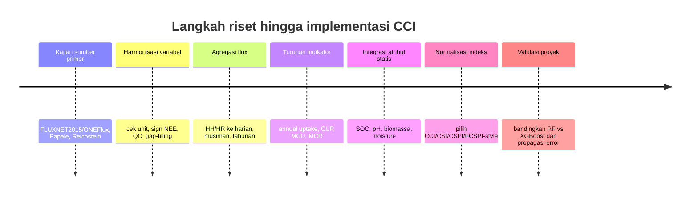
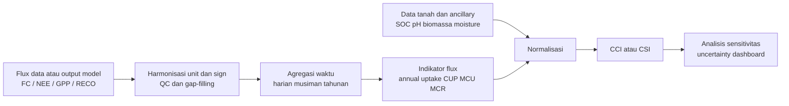

# Riset Literatur untuk Carbon Flux, CCI, dan CSI pada Proyek Sekuestrasi Karbon

## Ringkasan Eksekutif

Literatur primer menunjukkan bahwa variabel `NEE`, `GPP`, dan `RECO` dari jaringan eddy covariance seperti FLUXNET dan AmeriFlux adalah fondasi paling kuat untuk menilai pertukaran karbon ekosistem-atmosfer pada skala tapak. Dalam produk FLUXNET2015/ONEFlux, alur standarnya mencakup perhitungan `NEE` dari fluks turbulen dan storage, penyaringan berbasis `USTAR`, gap-filling, estimasi ketidakpastian acak, lalu partitioning `NEE` menjadi `GPP` dan `RECO`. Itu berarti, untuk proyek ini, `carbon_flux` yang paling defensible secara ilmiah adalah variabel bertipe flux seperti `FC` atau `NEE`, bukan sekadar konsentrasi `CO2` dalam ppm atau `umol mol^-1`.

Temuan penting kedua adalah bahwa `CCI`/`CSI` tidak memiliki satu definisi universal yang baku dalam literatur. Di studi urban canyon, `CCI` dipakai sebagai ukuran relatif kemampuan tangkap karbon antar-zona vegetasi dalam kondisi radiasi yang berbeda; di studi greenbelt dan studi Indonesia/Baghdad, `CSI` dipakai sebagai rasio atau skor yang membandingkan kemampuan sequestration terhadap beban emisi; di kehutanan, indeks yang mirip seperti `CSPI` dan `FCSPI` dipakai untuk mengukur potensi atau headroom sequestration berdasarkan `GPP`, carbon stock, forest cover, iklim, dan data tanah. Artinya, carbon flux bisa dipakai untuk "mencari CCI", tetapi hanya setelah flux itu diharmonisasi tandanya, diagregasi secara temporal, lalu dinormalisasi atau dikombinasikan dengan variabel pendukung seperti `SOC`, biomassa, dan kelembapan tanah.

Untuk proyek ini, jalur paling aman adalah:

1. Modelkan `carbon_flux`/`NEE` terlebih dahulu.
2. Turunkan metrik tahunan atau musiman seperti annual uptake, `CUP`, dan `MCU`.
3. Bangun `CCI` komposit dengan menambahkan `SOC` dan, bila tersedia, biomassa atau soil-moisture sebagai fitur statis per lokasi.

Struktur folder lokal juga konsisten dengan pendekatan ini karena memisahkan data flux dan data tanah, sehingga flux bisa dijadikan tabel time-series utama dan data tanah diperlakukan sebagai atribut lokasi, bukan digabung sembarang per baris lintas sumber.

## Referensi Inti yang Direkomendasikan

| No | Judul | Penulis | Tahun | Jurnal | DOI / Akses | Relevansi Singkat | Cocok untuk Proyek |
| --- | --- | --- | --- | --- | --- | --- | --- |
| 1 | The FLUXNET2015 dataset and the ONEFlux processing pipeline for eddy covariance data | Gilberto Pastorello dkk. | 2020 | Scientific Data | 10.1038/s41597-020-0534-3 | Sumber primer paling penting untuk memahami bagaimana `NEE`, `GPP`, dan `RECO` dibentuk, QC, uncertainty, dan versi variabel FLUXNET2015. | Ya, landasan utama jika model memakai data FLUXNET/AmeriFlux-tipe flux. |
| 2 | Towards a standardized processing of Net Ecosystem Exchange measured with eddy covariance technique: algorithms and uncertainty estimation | D. Papale dkk. | 2006 | Biogeosciences | 10.5194/bg-3-571-2006 | Paper klasik tentang koreksi standar, gap-filling, dan sumber ketidakpastian pada `NEE`. | Ya, untuk justifikasi preprocessing dan uncertainty. |
| 3 | On the separation of net ecosystem exchange into assimilation and ecosystem respiration: review and improved algorithm | Markus Reichstein dkk. | 2005 | Global Change Biology | 10.1111/j.1365-2486.2005.001002.x | Referensi inti untuk memisahkan `NEE` menjadi `GPP` dan `RECO`, terutama pendekatan nighttime-based. | Ya, penting jika `CCI` tidak hanya berbasis annual `NEE`, tetapi juga komponen uptake vs respiration. |
| 4 | Assessing the eddy covariance technique for evaluating carbon dioxide exchange rates of ecosystems: past, present and future | Dennis D. Baldocchi | 2003 | Global Change Biology | 10.1046/j.1365-2486.2003.00629.x | Review metodologis tentang kekuatan dan keterbatasan teknik eddy covariance, termasuk storage, advection, data gaps, dan skala waktu. | Ya, bagus untuk kajian pustaka dan pembahasan keterbatasan hasil. |
| 5 | SoilGrids 2.0: producing soil information for the globe with quantified spatial uncertainty | Laura Poggio dkk. | 2021 | SOIL | 10.5194/soil-7-217-2021 | Referensi utama untuk memakai SoilGrids sebagai sumber `SOC`, pH, bulk density, dan uncertainty spasial. | Ya, cocok untuk fitur statis seperti `SOC`/pH dalam `CCI` komposit. |
| 6 | Providing quality-assessed and standardised soil data to support global mapping and modelling (WoSIS snapshot 2023) | N.H. Batjes, L. Calisto, L.M. de Sousa | 2024 | Earth System Science Data | 10.5194/essd-16-4735-2024 | Menjelaskan WoSIS sebagai basis profil tanah terstandar untuk pemetaan dan pemodelan global. | Ya, cocok jika butuh profil tanah yang lebih observational daripada peta raster SoilGrids. |
| 7 | Building shading affects the ecosystem service of urban green spaces: Carbon capture in street canyons | Zhen Guo dkk. | 2020 | Ecological Modelling | 10.1016/j.ecolmodel.2020.109178 | Salah satu paper yang secara eksplisit memakai istilah Carbon Capture Index (`CCI`) pada konteks urban green space. | Ya, tetapi terbatas untuk definisi `CCI` sebagai skor relatif. |
| 8 | A Study on Carbon Sequestration Index as a Tool to Determine the Potential of Greenbelt | Tamanna Parida dkk. | 2022 | Journal of People, Plants, and Environment | 10.11628/ksppe.2022.25.4.371 | Menggunakan Carbon Sequestration Index (`CSI`) untuk menilai kemampuan spesies pohon/greenbelt menetralkan emisi. | Ya, berguna jika `CCI`/`CSI` ditafsirkan sebagai offset-style index. |
| 9 | A new remote sensing-based carbon sequestration potential index (CSPI): A tool to support land carbon management | Adrian Pascual dkk. | 2021 | Forest Ecology and Management | 10.1016/j.foreco.2021.119343 | Mengembangkan `CSPI` berbasis `GPP`, aboveground carbon density, dan forest cover untuk penilaian potensi sequestration. | Ya, contoh indeks komposit yang menggabungkan flux/produktivitas dan stok/potensi lahan. |
| 10 | A new index integrating forestry and ecology models for quantitatively characterizing forest carbon sequestration potential ability in a subtropical region | Yuanyong Dian dkk. | 2024 | Ecological Indicators | 10.1016/j.ecolind.2023.111358 | Mengusulkan `FCSPI` sebagai fractional deficiency dari karbon saat ini terhadap level maksimum. | Ya, cocok jika `CCI` didefinisikan sebagai remaining sequestration headroom. |
| 11 | Maximum carbon uptake rate dominates the interannual variability of global net ecosystem exchange | Zheng Fu dkk. | 2019 | Global Change Biology | 10.1111/gcb.14731 | Menunjukkan bagaimana annual `NEE` bisa diuraikan menjadi `MCU`, `MCR`, `CUP`, alpha, dan beta. | Ya, paling relevan jika ingin menurunkan indikator `CCI` langsung dari output flux time-series. |

Sumber primer dan dokumentasi resmi yang juga wajib disimpan sebagai rujukan kerja adalah FLUXNET Variables Quick Start Guide, FLUXNET Data Processing, AmeriFlux Data Variables, dokumentasi WoSIS, dan dokumentasi SoilGrids. Halaman ini menjelaskan unit, variabel, QC, dan struktur data yang langsung dipakai dalam implementasi.

## Sintesis Temuan dari Referensi Utama

Pastorello et al. 2020 adalah referensi primer untuk memahami produk FLUXNET2015. Paper ini menjelaskan bahwa pipeline ONEFlux menghitung `NEE` dari fluks turbulen dan fluks storage, lalu menerapkan spike detection, penyaringan kondisi turbulensi rendah dengan ensemble `USTAR` thresholds, gap-filling, estimasi random uncertainty, dan partitioning menjadi `RECO` dan `GPP`. Untuk proyek ini, paper tersebut tidak mendefinisikan `CCI` secara langsung, tetapi sangat penting untuk mendefinisikan input flux yang sah untuk `CCI` dan untuk memilih versi variabel seperti `NEE_VUT_REF`, `GPP_NT_VUT_REF`, atau `RECO_DT_VUT_REF`.

Papale et al. 2006 menstandarkan proses koreksi `NEE` dan menekankan bahwa ketidakpastian dari berbagai langkah koreksi bersifat penting dan sering aditif, dengan u*-correction menjadi salah satu sumber ketidakpastian terbesar. Paper ini berguna untuk justifikasi teknis ketika menjelaskan preprocessing pada notebook atau laporan. Di konteks `CCI`, kontribusinya bukan definisi indeks, melainkan memastikan bahwa flux yang diagregasi menjadi annual uptake atau seasonal index sudah melewati prosedur yang dapat dipertanggungjawabkan.

Reichstein et al. 2005 adalah paper kunci untuk memisahkan `NEE` menjadi `GPP` dan ecosystem respiration. Nilai praktisnya besar bila `CCI` tidak ingin dihitung hanya dari total net exchange tahunan, tetapi juga dari karakter "seberapa kuat uptake" versus "seberapa kuat respiration" suatu lokasi. Secara metodologis, paper ini mendasari pendekatan nighttime-based partitioning yang juga dipakai dalam produk FLUXNET/REddyProc.

Baldocchi 2003 memberi konteks konseptual yang lebih luas tentang kekuatan dan keterbatasan teknik eddy covariance. Teknik ini kuat untuk mengukur pertukaran `CO2` secara kontinu pada skala ekosistem, tetapi ketelitiannya dipengaruhi oleh homogenitas permukaan, keadaan atmosfer, storage, divergence, advection, dan ketersediaan data jangka panjang. Ini penting agar definisi `CCI` tidak terlalu overclaim.

Poggio et al. 2021 menjelaskan bahwa SoilGrids 2.0 memproduksi peta global sifat tanah pada resolusi 250 m dengan machine learning dan ketidakpastian spasial terkuantifikasi. Untuk proyek ini, fungsi utamanya adalah menyediakan covariate statis seperti `SOC`, pH, bulk density, dan texture untuk melengkapi sinyal flux. Paper ini tidak membahas `CCI` secara langsung, tetapi cocok untuk mendefinisikan kapasitas latar tanah yang dapat mendukung atau membatasi sequestration jangka panjang.

Batjes et al. 2024 memperjelas peran WoSIS sebagai basis profil tanah yang telah dinilai kualitasnya dan distandardisasi untuk pemetaan serta pemodelan global. Dibanding SoilGrids yang berbentuk peta prediktif, WoSIS lebih dekat ke observasi profil tanah yang menjadi bahan baku untuk pemetaan tersebut. Untuk `CCI` komposit, WoSIS paling tepat dipakai sebagai sumber verifikasi atau atribut statis per tapak, bukan sebagai time-series.

Guo et al. 2020 adalah salah satu sumber yang benar-benar memakai istilah Carbon Capture Index (`CCI`). Dalam studi itu, perubahan lingkungan bangunan mengubah distribusi radiasi siang hari dan memengaruhi carbon capture vegetasi; studi tersebut menunjukkan bahwa `CCI` zona pohon lebih tinggi daripada semak dan grassland. Kegunaan utamanya adalah menunjukkan bahwa `CCI` sering dipakai sebagai skor relatif dan problem-specific, bukan metrik universal.

Parida et al. 2022 menggunakan Carbon Sequestration Index (`CSI`) untuk menilai potensi greenbelt melalui pengukuran DBH, tinggi, serta estimasi biomassa above- dan below-ground. Paper ini penting karena menunjukkan satu keluarga definisi `CSI` yang dekat dengan pertanyaan praktis: apakah vegetasi yang ada cukup untuk menetralkan beban emisi tertentu. Keterbatasannya, `CSI` di sini lebih berbasis biomassa/stock daripada flux tower, sehingga perlu jembatan metodologis bila dijadikan turunan dari `NEE`.

Pascual et al. 2021 mengembangkan `CSPI` dengan menggabungkan `GPP`, aboveground carbon density (`ACD`), dan forest cover (`FC`) untuk mendukung pengambilan keputusan pengelolaan karbon lahan. Ini relevan karena menunjukkan cara menggabungkan flux-like productivity metric dengan stock metric dan land-cover opportunity dalam satu indeks.

Dian et al. 2024 mengusulkan `FCSPI` sebagai fractional deficiency of current forest carbon to its maximum level. Kelebihannya adalah memberi kerangka untuk indeks potensi, bukan hanya kinerja saat ini: lokasi dengan stok karbon sekarang jauh dari level maksimumnya berarti masih memiliki headroom sequestration yang besar.

Fu et al. 2019 adalah paper yang paling dekat dengan sasaran proyek bila ingin menghitung `CCI` dari output `carbon_flux`. Paper ini menunjukkan bahwa annual `NEE` dapat diuraikan menjadi indikator fisiologis dan fenologis seperti maximum carbon uptake (`MCU`), maximum carbon release (`MCR`), carbon uptake period (`CUP`), serta rasio alpha dan beta untuk sink/source aktual terhadap sink/source hipotetik. Dengan kata lain, paper ini menyediakan jembatan kuat dari flux time-series ke indikator terstruktur yang kemudian bisa dinormalisasi menjadi `CCI`.

## Formulasi CCI dan CSI dari Flux serta Data Pendukung

Literatur menunjukkan bahwa `CCI`/`CSI` merupakan keluarga indeks yang beragam, bukan satu rumus tunggal. Karena itu, cara terbaik untuk proyek ini adalah memilih definisi yang paling konsisten dengan tujuan analisis: mengukur kinerja tangkap karbon saat ini, kemampuan offset terhadap emisi, atau potensi sequestration masa depan.

### 1. Rasio Sequestration terhadap Emisi

Pendekatan pertama adalah rasio sequestration terhadap emisi, yang paling jelas terlihat pada keluarga studi `CSI`.

$$
CSI_{offset} = \frac{S_{CO2}}{E_{CO2}}
$$

Dengan:

- `S_CO2`: total karbon yang disekuestrasi per tahun dalam satuan `tCO2 tahun^-1` atau `kgCO2 tahun^-1`.
- `E_CO2`: total emisi yang ingin di-offset pada satuan yang sama.

Nilai `CSI > 1` berarti kapasitas sequestration melebihi emisi yang ditargetkan; `CSI < 1` berarti belum cukup. Ini cocok bila proyek ingin menghasilkan skor kecukupan penyerapan terhadap sumber emisi tertentu.

### 2. Indeks Potensi / Headroom

Pendekatan kedua adalah indeks potensi/headroom, seperti yang tersirat pada `FCSPI`.

$$
FCSPI = \frac{C_{max} - C_{cur}}{C_{max}} = 1 - \frac{C_{cur}}{C_{max}}
$$

Dengan:

- `C_cur`: stok karbon saat ini, umumnya pada satuan `Mg C ha^-1`.
- `C_max`: stok karbon maksimum, umumnya pada satuan `Mg C ha^-1`.

Nilai yang besar berarti lokasi tersebut masih punya ruang peningkatan sink yang besar; nilai mendekati nol berarti stok karbon sudah mendekati level maksimumnya. Ini cocok bila `CCI` dipakai untuk prioritas restorasi atau manajemen lahan.

### 3. CCI Berbasis Flux Aktual

Pendekatan ketiga adalah `CCI` berbasis flux aktual. Jika sign convention mengikuti atmosfer, yakni `NEE` negatif berarti uptake oleh ekosistem, maka annual net uptake dapat didefinisikan sebagai:

$$
U_{annual} = -\sum_{t=1}^{T} NEE_t \Delta t
$$

Jika input awal sudah dalam `g C m^-2 day^-1`, maka `Delta t` cukup `1 hari`. Jika masih half-hourly/hourly dalam `umol CO2 m^-2 s^-1`, lakukan konversi waktu dan molar terlebih dahulu.

Sesudah itu, `CCI` komposit yang praktis untuk proyek ini dapat ditulis sebagai:

$$
CCI_{proj} =
w_1 Norm(U_{annual}) +
w_2 Norm(SOC) +
w_3 Norm(BiomassC) +
w_4 Norm(Moisture/Stability)
$$

dengan:

$$
\sum w_i = 1
$$

Ini bukan rumus baku dari satu paper, tetapi turunan yang konsisten dengan penggunaan flux time-series dari FLUXNET/ONEFlux dan pemakaian `SOC`/soil properties sebagai covariate statis dari SoilGrids/WoSIS.

### 4. CCI Musiman Berbasis Indikator Flux

Pendekatan keempat adalah `CCI` musiman berbasis indikator flux, yang paling terinspirasi dari Fu et al. 2019.

$$
CCI_{flux-seasonal} =
w_1 Norm(MCU) +
w_2 Norm(CUP) +
w_3 Norm(\alpha) -
w_4 Norm(MCR)
$$

Dengan:

- `MCU`: maksimum laju uptake karbon.
- `CUP`: jumlah hari ketika ekosistem net sink.
- `alpha`: kedekatan terhadap sink musiman hipotetik.
- `MCR`: maksimum laju pelepasan karbon.

Indeks seperti ini lebih kaya informasi daripada sekadar annual total karena membedakan ekosistem yang sink kuat tetapi singkat dari ekosistem yang sink moderat tetapi stabil dan panjang. Untuk proyek yang ingin membandingkan dinamika antar lokasi, pendekatan ini sangat kuat.

Rekomendasi paling praktis adalah mulai dari pendekatan ketiga untuk versi awal proyek. Ia paling mudah dijalankan dari output model `carbon_flux`, paling selaras dengan data FLUXNET/AmeriFlux, dan paling mudah dijelaskan pada notebook maupun laporan akademik. Setelah itu, versi lanjutannya bisa menambahkan `MCU` dan `CUP` dari pendekatan keempat sebagai komponen tambahan.

## Konvensi, Satuan, dan Jebakan Metodologis

Hal terpenting yang sering tercampur adalah perbedaan antara konsentrasi dan flux. Dalam standar variabel FLUXNET/AmeriFlux, `CO2` berarti mole fraction dengan unit `umol CO2 mol^-1`, sedangkan `FC` berarti carbon dioxide flux dengan unit `umol CO2 m^-2 s^-1`; pada produk FLUXNET, `NEE`, `RECO`, dan `GPP` juga berada pada unit flux yang sama di resolusi half-hourly/hourly. Karena itu, model yang memprediksi konsentrasi `CO2` di udara atau di tanah tidak bisa langsung ditafsirkan sebagai sekuestrasi karbon tanpa model konversi flux yang valid. Untuk `CCI` proyek ini, target yang aman adalah `FC`/`NEE`, bukan konsentrasi `CO2`.

Konvensi tanda juga harus dicek sebelum menghitung indeks. Banyak studi eddy covariance menggunakan perspektif atmosfer, sehingga `NEE` negatif berarti ekosistem menyerap `CO2` dari atmosfer dan `NEE` positif berarti pelepasan `CO2` ke atmosfer. Karena beberapa dataset turunan atau notebook pengguna bisa membalik tanda, definisi pada file atau metadata yang benar-benar digunakan harus diverifikasi sebelum menghitung annual uptake.

Produk FLUXNET juga menegaskan bahwa perbedaan metode partitioning nighttime dan daytime bukan perkara kecil. Pada resolusi tahunan, selisih antar metode dapat mencapai lebih dari `500 g C m^-2 yr^-1`, dan ketidakpastian `USTAR` bisa menjadi sumber utama ketidakpastian produk. Ini berarti `CCI` yang dibangun dari annual `GPP`/`RECO`/`NEE` idealnya menyertakan analisis sensitivitas sederhana, misalnya membandingkan hasil dari `NT` dan `DT`, atau setidaknya memanfaatkan variabel referensi `_REF` yang disarankan FLUXNET.

Agregasi waktu juga krusial. FLUXNET mendistribusikan `GPP`/`RECO` pada unit `umol CO2 m^-2 s^-1` untuk half-hourly/hourly, lalu `g C m^-2 day^-1` untuk daily/weekly/monthly, dan `g C m^-2 year^-1` untuk yearly. Untuk implementasi `CCI`, sebaiknya bekerja pada satu unit karbon yang seragam, misalnya `g C m^-2 yr^-1`, supaya penggabungan dengan `SOC` atau biomassa lebih mudah ditafsirkan.

Ada satu jebakan interpretasi yang sering luput: `NEE` bukan identik dengan penyimpanan karbon jangka panjang penuh. `NEE` adalah inti penting dari sink darat, tetapi carbon balance jangka panjang juga dipengaruhi oleh gangguan, panen, kebakaran, ekspor lateral, dan komponen lain yang tidak selalu tertangkap sebagai `NEE` saja. Jadi, bila `CCI` dibangun murni dari annual `NEE`, indeks itu paling aman ditafsirkan sebagai kinerja penangkapan/pertukaran karbon di tingkat ekosistem, bukan klaim final tentang stok karbon permanen.

Untuk data tanah, perhatikan unit resmi ISRIC. Pada SoilGrids, nilai raster mentah disimpan sebagai integer dan beberapa layer perlu faktor konversi: misalnya `soc` memakai mapped units `dg kg^-1` dan dibagi 10 untuk menjadi `g kg^-1`, sedangkan `phh2o` tersimpan sebagai `pH x 10` dan juga perlu dibagi 10 agar menjadi pH konvensional. Pada dashboard WoSIS, organic carbon ditampilkan sebagai `g kg^-1` dan bulk density sebagai `g cm^-3`. Dalam proyek ini, variabel tanah seperti `SOC` dan pH paling aman diperlakukan sebagai fitur statis per site/depth, bukan sebagai time-series yang dijoin acak ke setiap timestamp flux.

## Urutan Baca, Sumber Resmi, dan Rencana Implementasi

Urutan baca yang direkomendasikan untuk implementasi:

1. Pastorello et al. 2020 untuk memahami struktur dan provenance flux products.
2. Papale et al. 2006 untuk preprocessing, gap-filling, dan uncertainty.
3. Reichstein et al. 2005 untuk partitioning `NEE` menjadi `GPP`/`RECO`.
4. Fu et al. 2019 untuk menurunkan indikator flux seperti `MCU` dan `CUP`.
5. Pascual et al. 2021 atau Parida et al. 2022, tergantung apakah `CCI` akan bertipe potential index atau offset index.

Jika butuh kajian konsep teknik eddy covariance yang lebih umum, sisipkan Baldocchi 2003 sebelum tahap implementasi.

Dokumentasi resmi yang paling penting untuk dibookmark:

- FLUXNET Variables Quick Start Guide.
- FLUXNET Data Processing.
- AmeriFlux Data Variables.
- WoSIS documentation.
- SoilGrids documentation.

Rencana implementasi `CCI` dari output `carbon_flux`:

1. Tetapkan dengan tegas arti `carbon_flux` di proyek. Bila berasal dari FLUXNET/AmeriFlux, prioritaskan `NEE`/`FC` atau gunakan nama produk resminya. Bila ternyata yang tersedia adalah konsentrasi `CO2`, jangan langsung menghitung `CCI`.
2. Harmonisasi tanda, unit, dan QC; gunakan agregasi official daily/yearly jika tersedia, atau konversi sendiri dari half-hourly.
3. Turunkan metrik utama: annual uptake, `CUP`, `MCU`, dan bila perlu `MCR`.
4. Gabungkan `SOC`, pH, dan bila tersedia biomassa atau soil moisture sebagai variabel statis per lokasi.
5. Normalisasi semua komponen sesuai definisi `CCI` yang dipilih.
6. Bawa error model flux, misalnya RMSE dari Random Forest dan XGBoost, ke dalam analisis sensitivitas `CCI`, agar skor akhirnya tidak tampak lebih pasti daripada data dasarnya.

Karena struktur folder lokal sudah menyiapkan campuran data flux dan tanah, pipeline ini realistis untuk dijalankan. Yang penting, gabungkan data tanah pada level site/plot/koordinat, bukan per baris timestamp lintas sumber, dan jadikan flux sebagai tabel utama time-series. Pendekatan ini konsisten dengan produk FLUXNET/AmeriFlux sebagai observasi dinamis dan WoSIS/SoilGrids sebagai atribut lokasi yang relatif statis.

## Diagram Alur dan Asumsi

Diagram berikut merangkum langkah riset dan implementasi `CCI` yang paling aman untuk proyek ini. Desain ini mengikuti alur dari sumber resmi FLUXNET/AmeriFlux dan pendekatan indeks dari literatur `CCI`/`CSI`/`CSPI`/`FCSPI`.

Asumsi yang dipakai:

- Proyek memiliki atau akan memakai time-series flux half-hourly/daily dari produk bergaya FLUXNET/AmeriFlux.
- Tanda `NEE` pada file final belum tentu sudah diverifikasi sehingga perlu dicek ulang.
- `SOC`/pH tersedia sebagai data per lokasi atau dapat diambil dari WoSIS/SoilGrids.
- Target proyek adalah land-based carbon capture/sequestration index, bukan industrial CCUS index.
- Flux dan data tanah lokal akan diintegrasikan dengan logika "flux dinamis + tanah statis".

## Open Questions / Limitations

Tidak ditemukan satu rumus universal resmi yang diberi nama Carbon Capture Index dan dipakai lintas domain. Yang tersedia adalah beberapa keluarga indeks yang berbeda sesuai konteks urban, kehutanan, greenbelt, atau pengelolaan lahan. Karena itu, keputusan terpenting proyek bukan mencari rumus `CCI` baku, melainkan memilih definisi `CCI` yang paling konsisten dengan tujuan proyek: menilai kinerja flux aktual, kemampuan offset terhadap emisi, atau potensi sequestration ke depan.

Literatur yang dihimpun sudah cukup untuk mendukung ketiga jalur itu, tetapi proyek perlu menetapkan satu definisi operasional saja agar model dan dashboard tetap konsisten.

## Referensi dan Tautan

- Pastorello et al. 2020, FLUXNET2015/ONEFlux: <https://www.nature.com/articles/s41597-020-0534-3>
- Papale et al. 2006, standardized NEE processing: <https://bg.copernicus.org/articles/3/571/2006/bg-3-571-2006.pdf>
- Reichstein et al. 2005, NEE partitioning: <https://researchportal.helsinki.fi/en/publications/on-the-separation-of-net-ecosystem-exchange-into-assimilation-and/>
- Baldocchi 2003, eddy covariance review: <https://www.sciencegate.app/document/10.1046/j.1365-2486.2003.00629.x>
- Poggio et al. 2021, SoilGrids 2.0: <https://soil.copernicus.org/articles/7/217/2021/>
- Batjes et al. 2024, WoSIS snapshot 2023: <https://essd.copernicus.org/articles/16/4735/2024/>
- Guo et al. 2020, Carbon Capture Index in street canyons: <https://www.sciencedirect.com/science/article/abs/pii/S0304380020302490>
- Parida et al. 2022, Carbon Sequestration Index for greenbelt: <https://scholar.kyobobook.co.kr/article/detail/4010036845836>
- Pascual et al. 2021, remote sensing-based CSPI: <https://www.sciencedirect.com/science/article/pii/S037811272100431X>
- Dian et al. 2024, FCSPI: <https://www.sciencedirect.com/science/article/pii/S1470160X23015005>
- Fu et al. 2019, MCU/CUP and global NEE variability: <https://ntrs.nasa.gov/citations/20190032412>
- FLUXNET Variables Quick Start Guide: <https://fluxnet.org/data/fluxnet2015-dataset/variables-quick-start-guide/>
- FLUXNET Data Processing: <https://fluxnet.org/data/fluxnet2015-dataset/data-processing/>
- FLUXNET Data Variables: <https://fluxnet.org/data/aboutdata/data-variables/>
- SoilGrids FAQ: <https://docs.isric.org/globaldata/soilgrids/SoilGrids_faqs_01.html>
