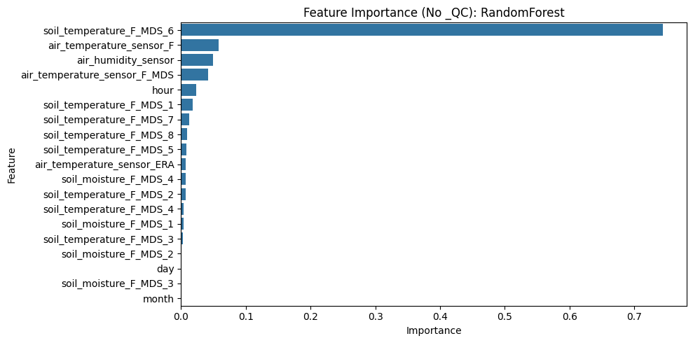

# Skenario A Baseline

Sumber: `skenario-a-baseline.ipynb`

# Baseline Prediksi Emisi Karbon (Skenario A)

Notebook ini membangun baseline model untuk prediksi emisi karbon menggunakan data time-series lingkungan dari stasiun AmeriFlux. Dua model yang dibandingkan: **RandomForestRegressor** dan **XGBoostRegressor**.

- Preprocessing dan mapping kolom sesuai skema IoT
- Validasi time-series (split kronologis)
- Evaluasi: MAE, RMSE, R2
- Visualisasi feature importance

---

## 1. Import Library dan Definisikan Fungsi Utilitas

Impor library yang dibutuhkan dan buat fungsi utilitas untuk evaluasi dan visualisasi.

## Cell 3 - Code

```python
# Import library utama
import pandas as pd
import numpy as np
import matplotlib.pyplot as plt
import seaborn as sns
from sklearn.ensemble import RandomForestRegressor
from xgboost import XGBRegressor
from sklearn.metrics import mean_absolute_error, mean_squared_error, root_mean_squared_error, r2_score
from sklearn.model_selection import train_test_split
import warnings
warnings.filterwarnings('ignore')

# Fungsi utilitas evaluasi

def evaluate_regression(y_true, y_pred):
    mae = mean_absolute_error(y_true, y_pred)
    rmse = root_mean_squared_error(y_true, y_pred) 
    r2 = r2_score(y_true, y_pred)
    return {"MAE": mae, "RMSE": rmse, "R2": r2}

# Fungsi visualisasi feature importance

def plot_feature_importance(model, feature_names, title='Feature Importance'):
    if hasattr(model, 'feature_importances_'):
        importances = model.feature_importances_
    else:
        importances = model.get_booster().get_score(importance_type='weight')
        importances = np.array([importances.get(f, 0) for f in feature_names])
    
    fi_df = pd.DataFrame({'Feature': feature_names, 'Importance': importances})
    fi_df = fi_df.sort_values('Importance', ascending=False)
    plt.figure(figsize=(10,5))
    sns.barplot(x='Importance', y='Feature', data=fi_df)
    plt.title(title)
    plt.tight_layout()
    plt.show()
```

## 2. Load dan Inspeksi Dataset

Muat data dari file CSV lokal dan tampilkan beberapa baris awal serta info struktur data.

## Cell 5 - Code

```python
# Path file CSV
csv_path = r'D:\Tugas Kuliah\Semester 6\MBKM - Magang\carbon\code-dataset-3\AmeriFlux\AMF_US-Ne1_FLUXNET_2001-2024_v1.3_r1\AMF_US-Ne1_FLUXNET_FLUXMET_HR_2001-2024_v1.3_r1.csv'

# Load data
raw_df = pd.read_csv(csv_path)

# Tampilkan beberapa baris awal dan info
print('Jumlah baris dan kolom:', raw_df.shape)
display(raw_df.head())
raw_df.info()
```

**Output:**

```text
Jumlah baris dan kolom: (210384, 241)
```

```text
   TIMESTAMP_START  TIMESTAMP_END  TA_F_MDS  TA_F_MDS_QC  TA_ERA    TA_F  \
0     200101010000   200101010100   -9999.0        -9999 -18.889 -18.889   
1     200101010100   200101010200   -9999.0        -9999 -19.966 -19.966   
2     200101010200   200101010300   -9999.0        -9999 -20.819 -20.819   
3     200101010300   200101010400   -9999.0        -9999 -20.854 -20.854   
4     200101010400   200101010500   -9999.0        -9999 -23.524 -23.524   

   TA_F_QC  SW_IN_POT  SW_IN_F_MDS  SW_IN_F_MDS_QC  ...  GPP_DT_CUT_USTAR50  \
0        2        0.0      -9999.0           -9999  ...             -9999.0   
1        2        0.0      -9999.0           -9999  ...             -9999.0   
2        2        0.0      -9999.0           -9999  ...             -9999.0   
3        2        0.0      -9999.0           -9999  ...             -9999.0   
4        2        0.0      -9999.0           -9999  ...             -9999.0   

   GPP_DT_CUT_MEAN  GPP_DT_CUT_SE  GPP_DT_CUT_05  GPP_DT_CUT_16  \
0          -9999.0            0.0        -9999.0        -9999.0   
1          -9999.0            0.0        -9999.0        -9999.0   
2          -9999.0            0.0        -9999.0        -9999.0   
3          -9999.0            0.0        -9999.0        -9999.0   
4          -9999.0            0.0        -9999.0        -9999.0   

   GPP_DT_CUT_25  GPP_DT_CUT_50  GPP_DT_CUT_75  GPP_DT_CUT_84  GPP_DT_CUT_95  
0        -9999.0        -9999.0        -9999.0        -9999.0        -9999.0  
1        -9999.0        -9999.0        -9999.0        -9999.0        -9999.0  
2        -9999.0        -9999.0        -9999.0        -9999.0        -9999.0  
3        -9999.0        -9999.0        -9999.0        -9999.0        -9999.0  
4        -9999.0        -9999.0        -9999.0        -9999.0        -9999.0  

[5 rows x 241 columns]
```

```text
<class 'pandas.DataFrame'>
RangeIndex: 210384 entries, 0 to 210383
Columns: 241 entries, TIMESTAMP_START to GPP_DT_CUT_95
dtypes: float64(171), int64(70)
memory usage: 386.8 MB
```

## 3. Preprocessing: Tangani Missing Value & Mapping Kolom

Ganti -9999 dengan NaN dan lakukan mapping nama kolom sesuai instruksi.

## Cell 7 - Code

```python
# Salin data untuk preprocessing

df = raw_df.copy()

# Ganti -9999 dengan NaN
for col in df.columns:
    df[col] = df[col].replace(-9999, np.nan)

# Mapping kolom sesuai instruksi
col_mapping = {}
for col in df.columns:
    if col == 'TIMESTAMP_START':
        col_mapping[col] = 'reading_time'
    elif col.startswith('TA_'):
        col_mapping[col] = 'air_temperature_sensor_' + col.split('_', 1)[-1] if '_' in col else 'air_temperature_sensor'
    elif col == 'RH':
        col_mapping[col] = 'air_humidity_sensor'
    elif col.startswith('TS_'):
        col_mapping[col] = 'soil_temperature_' + col.split('_', 1)[-1] if '_' in col else 'soil_temperature'
    elif col.startswith('SWC_'):
        col_mapping[col] = 'soil_moisture_' + col.split('_', 1)[-1] if '_' in col else 'soil_moisture'
    elif col == 'NEE_VUT_REF':
        col_mapping[col] = 'carbon_flux'
    else:
        col_mapping[col] = col

df = df.rename(columns=col_mapping)

display(df.head())
```

**Output:**

```text
   reading_time  TIMESTAMP_END  air_temperature_sensor_F_MDS  \
0  200101010000   200101010100                           NaN   
1  200101010100   200101010200                           NaN   
2  200101010200   200101010300                           NaN   
3  200101010300   200101010400                           NaN   
4  200101010400   200101010500                           NaN   

   air_temperature_sensor_F_MDS_QC  air_temperature_sensor_ERA  \
0                              NaN                     -18.889   
1                              NaN                     -19.966   
2                              NaN                     -20.819   
3                              NaN                     -20.854   
4                              NaN                     -23.524   

   air_temperature_sensor_F  air_temperature_sensor_F_QC  SW_IN_POT  \
0                   -18.889                            2        0.0   
1                   -19.966                            2        0.0   
2                   -20.819                            2        0.0   
3                   -20.854                            2        0.0   
4                   -23.524                            2        0.0   

   SW_IN_F_MDS  SW_IN_F_MDS_QC  ...  GPP_DT_CUT_USTAR50  GPP_DT_CUT_MEAN  \
0          NaN             NaN  ...                 NaN              NaN   
1          NaN             NaN  ...                 NaN              NaN   
2          NaN             NaN  ...                 NaN              NaN   
3          NaN             NaN  ...                 NaN              NaN   
4          NaN             NaN  ...                 NaN              NaN   

   GPP_DT_CUT_SE  GPP_DT_CUT_05  GPP_DT_CUT_16  GPP_DT_CUT_25  GPP_DT_CUT_50  \
0            0.0            NaN            NaN            NaN            NaN   
1            0.0            NaN            NaN            NaN            NaN   
2            0.0            NaN            NaN            NaN            NaN   
3            0.0            NaN            NaN            NaN            NaN   
4            0.0            NaN            NaN            NaN            NaN   

   GPP_DT_CUT_75  GPP_DT_CUT_84  GPP_DT_CUT_95  
0            NaN            NaN            NaN  
1            NaN            NaN            NaN  
2            NaN            NaN            NaN  
3            NaN            NaN            NaN  
4            NaN            NaN            NaN  

[5 rows x 241 columns]
```

## 4. Feature Engineering: Ekstraksi Fitur Waktu

Ekstrak fitur hour, day, dan month dari kolom reading_time.

## Cell 9 - Code

```python
# Pastikan reading_time bertipe string dan parse ke datetime

df['reading_time'] = pd.to_datetime(df['reading_time'], errors='coerce', format='%Y%m%d%H%M')

df['hour'] = df['reading_time'].dt.hour

df['day'] = df['reading_time'].dt.day

df['month'] = df['reading_time'].dt.month

display(df[['reading_time', 'hour', 'day', 'month']].head())
```

**Output:**

```text
         reading_time  hour  day  month
0 2001-01-01 00:00:00     0    1      1
1 2001-01-01 01:00:00     1    1      1
2 2001-01-01 02:00:00     2    1      1
3 2001-01-01 03:00:00     3    1      1
4 2001-01-01 04:00:00     4    1      1
```

## 5. Bersihkan Data: Drop Baris dengan Nilai Hilang pada Fitur Utama/Target

Drop baris yang memiliki missing value pada carbon_flux atau fitur utama.

## Cell 11 - Code

```python
# Deteksi dan hapus seluruh kolom _QC (hindari feature leakage)
qc_cols = [col for col in df.columns if '_QC' in col]
if qc_cols:
    print(f'Jumlah kolom _QC yang dihapus: {len(qc_cols)}')
    print('Contoh kolom yang dihapus:', qc_cols[:10])
    df = df.drop(columns=qc_cols)
else:
    print('Tidak ada kolom _QC yang ditemukan.')

# Pilih fitur utama dan target (setelah kolom _QC dibersihkan)
main_features = [
    col for col in df.columns if (
        col.startswith('air_temperature_sensor') or
        col == 'air_humidity_sensor' or
        col.startswith('soil_temperature') or
        col.startswith('soil_moisture')
    )
]
time_features = ['hour', 'day', 'month']
target = 'carbon_flux'

# Drop baris dengan missing value pada fitur utama atau target
clean_df = df.dropna(subset=main_features + time_features + [target]).reset_index(drop=True)

features = main_features + time_features
print(f'Jumlah data setelah dibersihkan: {clean_df.shape}')
print(f'Jumlah fitur input: {len(features)}')
print('Ada kolom _QC di fitur?', any('_QC' in c for c in features))
```

**Output:**

```text
Jumlah kolom _QC yang dihapus: 49
Contoh kolom yang dihapus: ['air_temperature_sensor_F_MDS_QC', 'air_temperature_sensor_F_QC', 'SW_IN_F_MDS_QC', 'SW_IN_F_QC', 'LW_IN_F_MDS_QC', 'LW_IN_F_QC', 'LW_IN_JSB_QC', 'LW_IN_JSB_F_QC', 'VPD_F_MDS_QC', 'VPD_F_QC']
Jumlah data setelah dibersihkan: (61, 195)
Jumlah fitur input: 19
Ada kolom _QC di fitur? False
```

## 6. Time-Series Train-Test Split (80/20 Kronologis)

Pisahkan data secara kronologis: 80% awal untuk train, 20% akhir untuk test.

## Cell 13 - Code

```python
# Urutkan data berdasarkan waktu
clean_df = clean_df.sort_values('reading_time').reset_index(drop=True)

# Split kronologis 80/20
n = len(clean_df)
n_train = int(0.8 * n)

train_df = clean_df.iloc[:n_train]
test_df = clean_df.iloc[n_train:]

print(f'Train: {train_df.shape}, Test: {test_df.shape}')
```

**Output:**

```text
Train: (48, 195), Test: (13, 195)
```

## 7. Latih Model RandomForestRegressor

Latih model RandomForestRegressor dengan fitur dinamis dan waktu.

## Cell 15 - Code

```python
# Fitur yang digunakan
features = main_features + time_features

X_train = train_df[features]
y_train = train_df[target]
X_test = test_df[features]
y_test = test_df[target]

# Inisialisasi dan latih RandomForestRegressor
rf_model = RandomForestRegressor(n_estimators=100, random_state=42, n_jobs=1)
rf_model.fit(X_train, y_train)

# Prediksi
y_pred_rf = rf_model.predict(X_test)
```

## 8. Latih Model XGBoostRegressor

Latih model XGBoostRegressor dengan fitur yang sama.

## Cell 17 - Code

```python
# Inisialisasi dan latih XGBoostRegressor
xgb_model = XGBRegressor(n_estimators=100, random_state=42, n_jobs=1, verbosity=0)
xgb_model.fit(X_train, y_train)

# Prediksi
y_pred_xgb = xgb_model.predict(X_test)
```

## 9. Evaluasi Model: MAE, RMSE, R2

Evaluasi performa kedua model pada data test.

## Cell 19 - Code

```python
# Evaluasi kedua model
rf_metrics = evaluate_regression(y_test, y_pred_rf)
xgb_metrics = evaluate_regression(y_test, y_pred_xgb)

# Simpan hasil evaluasi
eval_results = pd.DataFrame([
    {'Model': 'RandomForest', **rf_metrics},
    {'Model': 'XGBoost', **xgb_metrics}
])

# Print metrik secara jelas agar langsung terlihat di output
print('=== Hasil Evaluasi Model (Test Set) ===')
print(
    f"RandomForest -> MAE: {rf_metrics['MAE']:.4f} | "
    f"RMSE: {rf_metrics['RMSE']:.4f} | R2: {rf_metrics['R2']:.4f}"
)
print(
    f"XGBoost      -> MAE: {xgb_metrics['MAE']:.4f} | "
    f"RMSE: {xgb_metrics['RMSE']:.4f} | R2: {xgb_metrics['R2']:.4f}"
)
```

**Output:**

```text
=== Hasil Evaluasi Model (Test Set) ===
RandomForest -> MAE: 7.7168 | RMSE: 10.0492 | R2: 0.4563
XGBoost      -> MAE: 8.2250 | RMSE: 10.2915 | R2: 0.4297
```

## 10. Tabel Komparasi Performa Model

Tampilkan tabel perbandingan metrik evaluasi kedua model.

## Cell 21 - Code

```python
# Tampilkan tabel komparasi tanpa dependensi tambahan
print('\nRingkasan komparasi model:')
print(eval_results.to_string(index=False, float_format=lambda x: f'{x:.4f}'))
```

**Output:**

```text

Ringkasan komparasi model:
       Model    MAE    RMSE     R2
RandomForest 7.7168 10.0492 0.4563
     XGBoost 8.2250 10.2915 0.4297
```

## 11. Visualisasi Feature Importance Model Terbaik

Visualisasikan feature importance dari model dengan performa terbaik (MAE/RMSE terkecil, R2 terbesar).

## Cell 23 - Code

```python
# Pilih model terbaik berdasarkan MAE lalu RMSE terkecil
best_row = eval_results.sort_values(['MAE', 'RMSE', 'R2'], ascending=[True, True, False]).iloc[0]
best_model_name = best_row['Model']

if best_model_name == 'RandomForest':
    best_model = rf_model
else:
    best_model = xgb_model

print(f"\nModel terbaik: {best_model_name} (berdasarkan MAE lalu RMSE terkecil)")
print('Verifikasi fitur bersih _QC:', not any('_QC' in f for f in features))

plot_feature_importance(best_model, features, title=f'Feature Importance (No _QC): {best_model_name}')
```

**Output:**

```text

Model terbaik: RandomForest (berdasarkan MAE lalu RMSE terkecil)
Verifikasi fitur bersih _QC: True
```

```text
<Figure size 1000x500 with 1 Axes>
```


